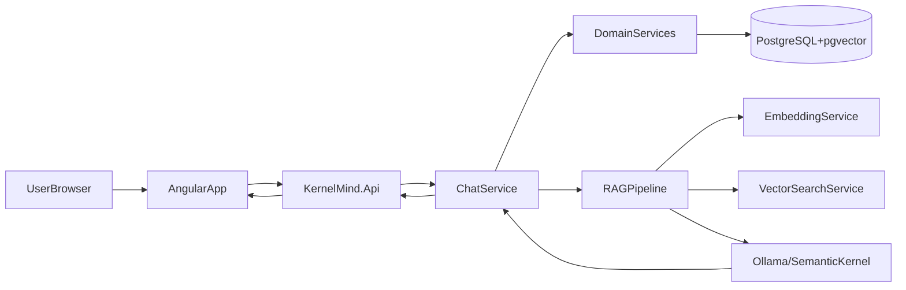

# 🧠 KernelMind – Architecture Documentation

## 📋 Overview

KernelMind is a full AI-powered pizza order chatbot application, demonstrating:
- **Semantic Kernel** with local LLM (Ollama)
- **RAG (Retrieval Augmented Generation)** with embeddings
- **Plugins** for business logic
- **Angular 19** modern frontend
- **.NET 10** backend API
- **PostgreSQL + pgvector** for semantic search
- **Docker Compose** for orchestration

### High-Level Flow



---

## 🏗️ Layered Architecture

```
┌─────────────────────────────────────────────────────────┐
│                    Frontend (Angular 19)                 │
│                  src/KernelMind.Web/                     │
│  ┌─────────────┐  ┌─────────────┐  ┌─────────────┐  │
│  │  ChatComponent│  │ MenuComponent│  │OrderComponent│ │
│  └──────┬──────┘  └──────┬──────┘  └──────┬──────┘  │
│         │                 │                 │          │
│         └────────────┬────┴────────────────┬──────────┘ │
│                      │                     │             │
│                      ▼                     ▼             │
│              ┌──────────────────────────────┐          │
│              │      ApiService / ChatService │          │
│              │      (HTTP + SSE Streaming)   │          │
│              └──────────────┬───────────────┘          │
└─────────────────────────────┼──────────────────────────┘
                              │ REST API
                              ▼
┌─────────────────────────────────────────────────────────┐
│                  Backend (.NET 10)                     │
│                   src/KernelMind.Api/                    │
│  ┌─────────────────────────────────────────────────┐   │
│  │                   Controllers                    │   │
│  │  ChatController  │  MenuController  │ Health  │   │
│  └─────────────────────────────────────────────────┘   │
│                          │                              │
│                          ▼                              │
│              ┌──────────────────────────────┐          │
│              │       Semantic Kernel         │          │
│              │  ┌─────────┐ ┌─────────┐    │          │
│              │  │MenuPlugin│ │OrderPlugin│   │          │
│              │  │CalcPlugin│ │ContextPlugin│   │          │
│              │  └────┬────┘ └────┬────┘    │          │
│              └───────┼───────────┼──────────┘          │
│                      │           │                      │
└──────────────────────┼───────────┼────────────────────┘
                        │           │
                        ▼           ▼
┌─────────────────────────────────────────────────────────┐
│                  Core Services                           │
│                  src/KernelMind.Core/                     │
│  ┌─────────────────────────────────────────────────┐   │
│  │                   Services                       │   │
│  │  ChatService  │ EmbeddingService │ VectorSearch│   │
│  └─────────────────────────────────────────────────┘   │
│                          │                              │
└──────────────────────────┼──────────────────────────┘
                           │
                           ▼
┌─────────────────────────────────────────────────────────┐
│                Infrastructure                           │
│              src/KernelMind.Infrastructure/              │
│  ┌─────────────────────────────────────────────────┐   │
│  │              Repositories                       │   │
│  │  PizzaRepository │ OrderRepository │ ChatSession│   │
│  └─────────────────────────────────────────────────┘   │
│                          │                              │
│                          ▼                              │
│              ┌──────────────────────────────┐          │
│              │         AppDbContext         │          │
│              │     (EF Core + pgvector)     │          │
│              └──────────────┬───────────────┘          │
└─────────────────────────────┼──────────────────────────┘
                              │ EF Core
                              ▼
┌─────────────────────────────────────────────────────────┐
│                    Database                              │
│              PostgreSQL + pgvector                       │
│  ┌─────────────────────────────────────────────────┐   │
│  │                   Tables                          │   │
│  │  pizzas │ orders │ order_items │ customers │      │   │
│  │  chat_sessions │ chat_messages │ embeddings │     │   │
│  └─────────────────────────────────────────────────┘   │
└─────────────────────────────────────────────────────────┘
```

---

## 🤖 Semantic Kernel & Plugins

### MenuPlugin
```csharp
// Available functions
- list_menu() → Formats and returns the full menu
- search_pizza(query) → Search pizzas by name
- get_pizza_details(name) → Details for a pizza
- get_pizza_ingredients(name) → List ingredients
- get_vegetarian_pizzas() → Filter vegetarian pizzas
- get_spicy_pizzas() → Filter spicy pizzas
- get_popular_pizzas() → Return popular pizzas
```

### OrderPlugin
```csharp
// Available functions
- create_order(customer, address, phone) → Create new order
- add_item_to_order(order_token, pizza_name, quantity) → Add item
- view_order(order_token) → View current order
- confirm_order(order_token) → Confirm order to kitchen
- cancel_order(order_token) → Cancel order
- get_order_tracking(order_token) → Tracking status
- add_tip(order_token, amount) → Add tip
```

### CalculationPlugin
```csharp
// Available functions
- calculate_total(subtotal) → Calculate total with delivery
- calculate_delivery_fee(distance) → Fee by distance
- estimate_delivery_time(distance) → Estimated time
- apply_discount(total, coupon_code) → Apply coupon
- check_promotion() → Day promotions
- split_bill(total, people) → Split bill
- calculate_total_with_delivery(subtotal, distance) → Full total
```

### ContextPlugin
```csharp
// Available functions
- set_context(session, key, value) → Store information
- get_context(session, key) → Retrieve information
- clear_context(session) → Clear context
- get_conversation_summary(session) → Conversation summary
- save_message(session, role, content) → Save message
- get_history(session) → Message history
```

---

## 📚 RAG (Retrieval Augmented Generation)

### Vectorization Pipeline
```
┌─────────────────────────────────────────────────────────┐
│                   RAG Pipeline                           │
├─────────────────────────────────────────────────────────┤
│                                                         │
│  1. TEXT INPUT                                         │
│     "pizza with mozzarella tomato and basil"            │
│                      │                                  │
│                      ▼                                  │
│  2. EMBEDDING GENERATION                               │
│     EmbeddingService.GenerateEmbedding(text)            │
│     → float[768] vector                                │
│                      │                                  │
│                      ▼                                  │
│  3. VECTOR SEARCH (pgvector)                            │
│     SELECT * FROM pizzas                                │
│     ORDER BY embedding <=> query_embedding             │
│     LIMIT 5                                            │
│                      │                                  │
│                      ▼                                  │
│  4. RETRIEVED CONTEXT                                 │
│     Pizza 1: "Margherita" - Similarity: 0.85           │
│     Pizza 2: "Calabresa" - Similarity: 0.72            │
│                      │                                  │
│                      ▼                                  │
│  5. LLM PROMPT COMPLETION                             │
│     "Based on these pizzas: [context]"                  │
│     + User query: "what do you have?"                   │
│                      │                                  │
│                      ▼                                  │
│  6. GENERATED RESPONSE                                 │
│     "We have great pizzas! Margherita is classic       │
│      with tomato, mozzarella and basil...              │
│      Would you like to order?"                         │
└─────────────────────────────────────────────────────────┘
```

### Embedding Service
```csharp
// Generates 768-dimensional embeddings
public async Task<float[]> GenerateEmbeddingAsync(string text)
{
    // Uses Ollama with nomic-embed-text model
    var embeddings = await _embeddingGenerator.GenerateAsync(text);
    return embeddings[0].Vector.ToArray();
}

// Cosine similarity
public float CalculateSimilarity(float[] v1, float[] v2)
{
    var dot = v1.Zip(v2).Sum(x => x.First * x.Second);
    var norm1 = Math.Sqrt(v1.Sum(x => x * x));
    var norm2 = Math.Sqrt(v2.Sum(x => x * x));
    return dot / (norm1 * norm2);
}
```

---

## 🌐 API Endpoints

### Chat
The chat service limits history to the **last 10 messages** (normal and streaming mode) to keep performance and context stable. See [docs/API.md](API.md) for contracts and streaming.

| Method | Endpoint | Description |
|--------|-----------|-------------|
| POST | /api/chat/message | Send message |
| POST | /api/chat/stream | SSE streaming |
| POST | /api/chat/stream/raw | Raw SSE streaming |
| GET | /api/chat/health | Health check |

### Menu
| Method | Endpoint | Description |
|--------|-----------|-------------|
| GET | /api/menu | Full list |
| GET | /api/menu/{id} | Pizza by ID |
| GET | /api/menu/search | Search by name |
| GET | /api/menu/semantic-search | Semantic search |
| GET | /api/menu/hybrid-search | Hybrid search |
| GET | /api/menu/{id}/similar | Similar pizzas |
| POST | /api/menu/vectorize | Vectorize menu |
| POST | /api/menu/reindex | Re-vectorize |
| GET | /api/menu/categories | List categories |
| GET | /api/menu/category/{name} | By category |

### Orders
| Method | Endpoint | Description |
|--------|-----------|-------------|
| GET | /api/orders | List orders |
| GET | /api/orders/{id} | Details |
| POST | /api/orders | Create order |
| PATCH | /api/orders/{id}/status | Update status |
| POST | /api/orders/{id}/cancel | Cancel |
| GET | /api/orders/{id}/total | Calculate total |

### Health
| Method | Endpoint | Description |
|--------|-----------|-------------|
| GET | /health | Health check |
| GET | /healthz | Liveness |
| GET | /readyz | Readiness |

---

## 💾 Database Schema

### Main Tables

```sql
-- Pizzas
CREATE TABLE kernelmind.pizzas (
    id UUID PRIMARY KEY DEFAULT gen_random_uuid(),
    name VARCHAR(100) NOT NULL,
    description VARCHAR(500),
    price DECIMAL(10,2) NOT NULL,
    category VARCHAR(50),
    ingredients TEXT[],
    is_available BOOLEAN DEFAULT TRUE,
    embedding VECTOR(768),
    created_at TIMESTAMP DEFAULT CURRENT_TIMESTAMP,
    updated_at TIMESTAMP DEFAULT CURRENT_TIMESTAMP
);

-- Orders
CREATE TABLE kernelmind.orders (
    id UUID PRIMARY KEY DEFAULT gen_random_uuid(),
    customer_id UUID,
    status VARCHAR(50) NOT NULL DEFAULT 'Pending',
    total_amount DECIMAL(10,2) DEFAULT 0,
    delivery_address VARCHAR(500),
    notes VARCHAR(1000),
    created_at TIMESTAMP DEFAULT CURRENT_TIMESTAMP,
    updated_at TIMESTAMP DEFAULT CURRENT_TIMESTAMP
);

-- Order Items
CREATE TABLE kernelmind.order_items (
    id UUID PRIMARY KEY DEFAULT gen_random_uuid(),
    order_id UUID REFERENCES kernelmind.orders(id),
    pizza_id UUID REFERENCES kernelmind.pizzas(id),
    quantity INT NOT NULL DEFAULT 1,
    unit_price DECIMAL(10,2) NOT NULL,
    notes VARCHAR(500),
    created_at TIMESTAMP DEFAULT CURRENT_TIMESTAMP
);

-- Chat Sessions
CREATE TABLE kernelmind.chat_sessions (
    id UUID PRIMARY KEY DEFAULT gen_random_uuid(),
    session_token VARCHAR(100) UNIQUE NOT NULL,
    customer_id UUID,
    is_active BOOLEAN DEFAULT TRUE,
    created_at TIMESTAMP DEFAULT CURRENT_TIMESTAMP,
    last_activity_at TIMESTAMP DEFAULT CURRENT_TIMESTAMP
);

-- Chat Messages
CREATE TABLE kernelmind.chat_messages (
    id UUID PRIMARY KEY DEFAULT gen_random_uuid(),
    session_id UUID REFERENCES kernelmind.chat_sessions(id),
    role VARCHAR(20) NOT NULL,
    content TEXT NOT NULL,
    metadata JSONB,
    created_at TIMESTAMP DEFAULT CURRENT_TIMESTAMP
);
```

---

## 🐳 Docker Orchestration

### Services
| Service | Image | Ports |
|---------|-------|-------|
| postgres | postgres:16-alpine | 5432 |
| ollama | ollama/ollama | 11434 |
| backend | kernelmind-api | 5076 |
| frontend | kernelmind-web | 4200/80 |

### Networks
```
kernelmind-network (bridge)
  Subnet: 172.20.0.0/16
  Gateway: 172.20.0.1
```

---

## 🔒 Security

### Nginx Headers
```nginx
add_header X-Frame-Options "SAMEORIGIN" always;
add_header X-Content-Type-Options "nosniff" always;
add_header X-XSS-Protection "1; mode=block" always;
add_header Referrer-Policy "strict-origin-when-cross-origin" always;
```

### Non-root Containers
- Nginx runs as user `nginxuser`
- Frontend container user ID: 101
- Backend does not require root

---

## 📊 Performance

### Resource Limits
| Service | Memory | CPU |
|---------|--------|-----|
| PostgreSQL | 1GB | 1 core |
| Ollama | 8GB | 2 cores |
| Backend | 2GB | 1 core |
| Frontend | 256MB | 0.5 core |

### Optimizations
- IVFFlat vector indexing
- Gzip compression
- CDN for static assets
- Connection pooling

---

## 🧪 Testing

### Coverage
- **Unit Tests**: 31 tests
- **Integration Tests**: 15 tests
- **Total**: 46 tests

### Test Projects
```
tests/
├── KernelMind.UnitTests/       # xUnit + Moq
└── KernelMind.IntegrationTests/  # EF Core InMemory
```

---

## 📁 Folder Structure

```
KernelMind/
├── src/
│   ├── KernelMind.Api/              # API Controllers + Filters
│   ├── KernelMind.Core/             # Business Logic + Plugins
│   │   ├── Plugins/
│   │   └── Services/
│   ├── KernelMind.Domain/            # Entities + Interfaces
│   │   ├── Entities/
│   │   ├── Interfaces/
│   │   └── ValueObjects/
│   ├── KernelMind.Infrastructure/   # Data Access + Repositories
│   │   ├── Data/
│   │   │   ├── Configurations/
│   │   │   └── Converters/
│   │   ├── Migrations/
│   │   └── Repositories/
│   └── KernelMind.Web/              # Angular Frontend
│       ├── src/
│       │   ├── app/
│       │   │   ├── components/
│       │   │   ├── services/
│       │   │   └── models/
│       │   └── environments/
│       ├── nginx.conf
│       └── Dockerfile
├── docker/
│   ├── postgres/
│   ├── ollama/
│   └── nginx/
├── scripts/
├── tests/
│   ├── KernelMind.UnitTests/
│   └── KernelMind.IntegrationTests/
├── docs/
├── docker-compose.yml
├── docker-compose.override.yml
└── README.md
```
