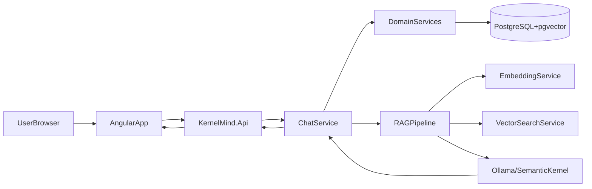

# 🧠 KernelMind - Documentação de Arquitetura

## 📋 Visão Geral

KernelMind é uma aplicação completa de chatbot para pedidos de pizza com IA, demonstrando:
- **Semantic Kernel** com LLM local (Ollama)
- **RAG (Retrieval Augmented Generation)** com embeddings
- **Plugins** para lógica de negócios
- **Angular 19** frontend moderno
- **.NET 10** backend API
- **PostgreSQL + pgvector** para busca semântica
- **Docker Compose** para orquestração

### Fluxo em alto nível



---

## 🏗️ Arquitetura de Camadas

```
┌─────────────────────────────────────────────────────────┐
│                    Frontend (Angular 19)                 │
│                  src/KernelMind.Web/                     │
│  ┌─────────────┐  ┌─────────────┐  ┌─────────────┐  │
│  │  ChatComponent│  │ MenuComponent│  │OrderComponent│ │
│  └──────┬──────┘  └──────┬──────┘  └──────┬──────┘  │
│         │                 │                 │          │
│         └────────────┬────┴────────────────┬──────────┘ │
│                      │                     │             │
│                      ▼                     ▼             │
│              ┌──────────────────────────────┐          │
│              │      ApiService / ChatService │          │
│              │      (HTTP + SSE Streaming)   │          │
│              └──────────────┬───────────────┘          │
└─────────────────────────────┼──────────────────────────┘
                              │ REST API
                              ▼
┌─────────────────────────────────────────────────────────┐
│                  Backend (.NET 10)                     │
│                   src/KernelMind.Api/                    │
│  ┌─────────────────────────────────────────────────┐   │
│  │                   Controllers                    │   │
│  │  ChatController  │  MenuController  │ Health  │   │
│  └─────────────────────────────────────────────────┘   │
│                          │                              │
│                          ▼                              │
│              ┌──────────────────────────────┐          │
│              │       Semantic Kernel         │          │
│              │  ┌─────────┐ ┌─────────┐    │          │
│              │  │MenuPlugin│ │OrderPlugin│   │          │
│              │  │CalcPlugin│ │ContextPlugin│   │          │
│              │  └────┬────┘ └────┬────┘    │          │
│              └───────┼───────────┼──────────┘          │
│                      │           │                      │
└──────────────────────┼───────────┼────────────────────┘
                        │           │
                        ▼           ▼
┌─────────────────────────────────────────────────────────┐
│                  Core Services                           │
│                  src/KernelMind.Core/                     │
│  ┌─────────────────────────────────────────────────┐   │
│  │                   Services                       │   │
│  │  ChatService  │ EmbeddingService │ VectorSearch│   │
│  └─────────────────────────────────────────────────┘   │
│                          │                              │
└──────────────────────────┼──────────────────────────┘
                           │
                           ▼
┌─────────────────────────────────────────────────────────┐
│                Infrastructure                           │
│              src/KernelMind.Infrastructure/              │
│  ┌─────────────────────────────────────────────────┐   │
│  │              Repositories                       │   │
│  │  PizzaRepository │ OrderRepository │ ChatSession│   │
│  └─────────────────────────────────────────────────┘   │
│                          │                              │
│                          ▼                              │
│              ┌──────────────────────────────┐          │
│              │         AppDbContext         │          │
│              │     (EF Core + pgvector)     │          │
│              └──────────────┬───────────────┘          │
└─────────────────────────────┼──────────────────────────┘
                              │ EF Core
                              ▼
┌─────────────────────────────────────────────────────────┐
│                    Database                              │
│              PostgreSQL + pgvector                       │
│  ┌─────────────────────────────────────────────────┐   │
│  │                   Tables                          │   │
│  │  pizzas │ orders │ order_items │ customers │      │   │
│  │  chat_sessions │ chat_messages │ embeddings │     │   │
│  └─────────────────────────────────────────────────┘   │
└─────────────────────────────────────────────────────────┘
```

---

## 🤖 Semantic Kernel & Plugins

### MenuPlugin
```csharp
// Funções disponíveis
- list_menu() → Formata e retorna o cardápio completo
- search_pizza(query) → Busca pizzas por nome
- get_pizza_details(name) → Detalhes de uma pizza
- get_pizza_ingredients(name) → Lista ingredientes
- get_vegetarian_pizzas() → Filtra pizzas vegetarianas
- get_spicy_pizzas() → Filtra pizzas picantes
- get_popular_pizzas() → Retorna pizzas populares
```

### OrderPlugin
```csharp
// Funções disponíveis
- create_order(customer, address, phone) → Cria novo pedido
- add_item_to_order(order_token, pizza_name, quantity) → Adiciona item
- view_order(order_token) → Visualiza pedido atual
- confirm_order(order_token) → Confirma envio para cozinha
- cancel_order(order_token) → Cancela pedido
- get_order_tracking(order_token) → Status de rastreamento
- add_tip(order_token, amount) → Adiciona gorjeta
```

### CalculationPlugin
```csharp
// Funções disponíveis
- calculate_total(subtotal) → Calcula total com entrega
- calculate_delivery_fee(distance) → Taxa por distância
- estimate_delivery_time(distance) → Tempo estimado
- apply_discount(total, coupon_code) → Aplica cupom
- check_promotion() → Promoções do dia
- split_bill(total, people) → Divide conta
- calculate_total_with_delivery(subtotal, distance) → Total completo
```

### ContextPlugin
```csharp
// Funções disponíveis
- set_context(session, key, value) → Armazena informação
- get_context(session, key) → Recupera informação
- clear_context(session) → Limpa contexto
- get_conversation_summary(session) → Resumo da conversa
- save_message(session, role, content) → Salva mensagem
- get_history(session) → Histórico de mensagens
```

---

## 📚 RAG (Retrieval Augmented Generation)

### Pipeline de Vetorização
```
┌─────────────────────────────────────────────────────────┐
│                   Pipeline RAG                           │
├─────────────────────────────────────────────────────────┤
│                                                         │
│  1. TEXT INPUT                                         │
│     "pizza de mussarela com tomate e manjericão"        │
│                      │                                  │
│                      ▼                                  │
│  2. EMBEDDING GENERATION                               │
│     EmbeddingService.GenerateEmbedding(text)            │
│     → float[768] vector                                │
│                      │                                  │
│                      ▼                                  │
│  3. VECTOR SEARCH (pgvector)                            │
│     SELECT * FROM pizzas                                │
│     ORDER BY embedding <=> query_embedding             │
│     LIMIT 5                                            │
│                      │                                  │
│                      ▼                                  │
│  4. RETRIEVED CONTEXT                                 │
│     Pizza 1: "Margherita" - Similarity: 0.85           │
│     Pizza 2: "Calabresa" - Similarity: 0.72            │
│                      │                                  │
│                      ▼                                  │
│  5. LLM PROMPT COMPLETION                             │
│     "Based on these pizzas: [context]"                  │
│     + User query: "o que você tem?"                    │
│                      │                                  │
│                      ▼                                  │
│  6. GENERATED RESPONSE                                 │
│     "Temos várias pizzas ótimas! A Margherita é         │
│      clássica com tomate, mussarela e manjericão...     │
│      Gostaria de pedir?"                               │
└─────────────────────────────────────────────────────────┘
```

### Embedding Service
```csharp
// Gera embeddings de 768 dimensões
public async Task<float[]> GenerateEmbeddingAsync(string text)
{
    // Usa Ollama com modelo nomic-embed-text
    var embeddings = await _embeddingGenerator.GenerateAsync(text);
    return embeddings[0].Vector.ToArray();
}

// Calcula similaridade cosseno
public float CalculateSimilarity(float[] v1, float[] v2)
{
    var dot = v1.Zip(v2).Sum(x => x.First * x.Second);
    var norm1 = Math.Sqrt(v1.Sum(x => x * x));
    var norm2 = Math.Sqrt(v2.Sum(x => x * x));
    return dot / (norm1 * norm2);
}
```

---

## 🌐 API Endpoints

### Chat
O serviço de chat limita o histórico às **últimas 10 mensagens** (modo normal e streaming) para manter performance e contexto estável. Ver [docs/API.md](API.md) para contratos e streaming.

| Method | Endpoint | Description |
|--------|-----------|-------------|
| POST | /api/chat/message | Enviar mensagem |
| POST | /api/chat/stream | Streaming SSE |
| POST | /api/chat/stream/raw | Streaming raw SSE |
| GET | /api/chat/health | Health check |

### Menu
| Method | Endpoint | Description |
|--------|-----------|-------------|
| GET | /api/menu | Lista completa |
| GET | /api/menu/{id} | Pizza por ID |
| GET | /api/menu/search | Busca por nome |
| GET | /api/menu/semantic-search | Busca semântica |
| GET | /api/menu/hybrid-search | Busca híbrida |
| GET | /api/menu/{id}/similar | Pizzas similares |
| POST | /api/menu/vectorize | Vetoriza cardápio |
| POST | /api/menu/reindex | Re-vetoriza |
| GET | /api/menu/categories | Lista categorias |
| GET | /api/menu/category/{name} | Por categoria |

### Orders
| Method | Endpoint | Description |
|--------|-----------|-------------|
| GET | /api/orders | Lista pedidos |
| GET | /api/orders/{id} | Detalhes |
| POST | /api/orders | Cria pedido |
| PATCH | /api/orders/{id}/status | Atualiza status |
| POST | /api/orders/{id}/cancel | Cancela |
| GET | /api/orders/{id}/total | Calcula total |

### Health
| Method | Endpoint | Description |
|--------|-----------|-------------|
| GET | /health | Health check |
| GET | /healthz | Liveness |
| GET | /readyz | Readiness |

---

## 💾 Schema do Banco de Dados

### Tabelas Principais

```sql
-- Pizzas
CREATE TABLE kernelmind.pizzas (
    id UUID PRIMARY KEY DEFAULT gen_random_uuid(),
    name VARCHAR(100) NOT NULL,
    description VARCHAR(500),
    price DECIMAL(10,2) NOT NULL,
    category VARCHAR(50),
    ingredients TEXT[],
    is_available BOOLEAN DEFAULT TRUE,
    embedding VECTOR(768),
    created_at TIMESTAMP DEFAULT CURRENT_TIMESTAMP,
    updated_at TIMESTAMP DEFAULT CURRENT_TIMESTAMP
);

-- Pedidos
CREATE TABLE kernelmind.orders (
    id UUID PRIMARY KEY DEFAULT gen_random_uuid(),
    customer_id UUID,
    status VARCHAR(50) NOT NULL DEFAULT 'Pending',
    total_amount DECIMAL(10,2) DEFAULT 0,
    delivery_address VARCHAR(500),
    notes VARCHAR(1000),
    created_at TIMESTAMP DEFAULT CURRENT_TIMESTAMP,
    updated_at TIMESTAMP DEFAULT CURRENT_TIMESTAMP
);

-- Itens do Pedido
CREATE TABLE kernelmind.order_items (
    id UUID PRIMARY KEY DEFAULT gen_random_uuid(),
    order_id UUID REFERENCES kernelmind.orders(id),
    pizza_id UUID REFERENCES kernelmind.pizzas(id),
    quantity INT NOT NULL DEFAULT 1,
    unit_price DECIMAL(10,2) NOT NULL,
    notes VARCHAR(500),
    created_at TIMESTAMP DEFAULT CURRENT_TIMESTAMP
);

-- Sessões de Chat
CREATE TABLE kernelmind.chat_sessions (
    id UUID PRIMARY KEY DEFAULT gen_random_uuid(),
    session_token VARCHAR(100) UNIQUE NOT NULL,
    customer_id UUID,
    is_active BOOLEAN DEFAULT TRUE,
    created_at TIMESTAMP DEFAULT CURRENT_TIMESTAMP,
    last_activity_at TIMESTAMP DEFAULT CURRENT_TIMESTAMP
);

-- Mensagens de Chat
CREATE TABLE kernelmind.chat_messages (
    id UUID PRIMARY KEY DEFAULT gen_random_uuid(),
    session_id UUID REFERENCES kernelmind.chat_sessions(id),
    role VARCHAR(20) NOT NULL,
    content TEXT NOT NULL,
    metadata JSONB,
    created_at TIMESTAMP DEFAULT CURRENT_TIMESTAMP
);
```

---

## 🐳 Orquestração Docker

### Services
| Service | Image | Ports |
|---------|-------|-------|
| postgres | postgres:16-alpine | 5432 |
| ollama | ollama/ollama | 11434 |
| backend | kernelmind-api | 5076 |
| frontend | kernelmind-web | 4200/80 |

### Redes
```
kernelmind-network (bridge)
  Subnet: 172.20.0.0/16
  Gateway: 172.20.0.1
```

---

## 🔒 Segurança

### Headers Nginx
```nginx
add_header X-Frame-Options "SAMEORIGIN" always;
add_header X-Content-Type-Options "nosniff" always;
add_header X-XSS-Protection "1; mode=block" always;
add_header Referrer-Policy "strict-origin-when-cross-origin" always;
```

### Non-root Containers
- Nginx executa como usuário `nginxuser`
- Frontend container user ID: 101
- Backend não requer root

---

## 📊 Performance

### Limites de Recursos
| Service | Memory | CPU |
|---------|--------|-----|
| PostgreSQL | 1GB | 1 core |
| Ollama | 8GB | 2 cores |
| Backend | 2GB | 1 core |
| Frontend | 256MB | 0.5 core |

### Otimizações
- Indexação vetorial IVFFlat
- Gzip compression
- CDN para assets estáticos
- Connection pooling

---

## 🧪 Testes

### Cobertura
- **Unit Tests**: 31 testes
- **Integration Tests**: 15 testes
- **Total**: 46 testes

### Projetos de Teste
```
tests/
├── KernelMind.UnitTests/       # xUnit + Moq
└── KernelMind.IntegrationTests/  # EF Core InMemory
```

---

## 📁 Estrutura de Pastas

```
KernelMind/
├── src/
│   ├── KernelMind.Api/              # API Controllers + Filters
│   ├── KernelMind.Core/             # Business Logic + Plugins
│   │   ├── Plugins/
│   │   └── Services/
│   ├── KernelMind.Domain/            # Entities + Interfaces
│   │   ├── Entities/
│   │   ├── Interfaces/
│   │   └── ValueObjects/
│   ├── KernelMind.Infrastructure/   # Data Access + Repositories
│   │   ├── Data/
│   │   │   ├── Configurations/
│   │   │   └── Converters/
│   │   ├── Migrations/
│   │   └── Repositories/
│   └── KernelMind.Web/              # Angular Frontend
│       ├── src/
│       │   ├── app/
│       │   │   ├── components/
│       │   │   ├── services/
│       │   │   └── models/
│       │   └── environments/
│       ├── nginx.conf
│       └── Dockerfile
├── docker/
│   ├── postgres/
│   ├── ollama/
│   └── nginx/
├── scripts/
├── tests/
│   ├── KernelMind.UnitTests/
│   └── KernelMind.IntegrationTests/
├── docs/
├── docker-compose.yml
├── docker-compose.override.yml
└── README.md
```
